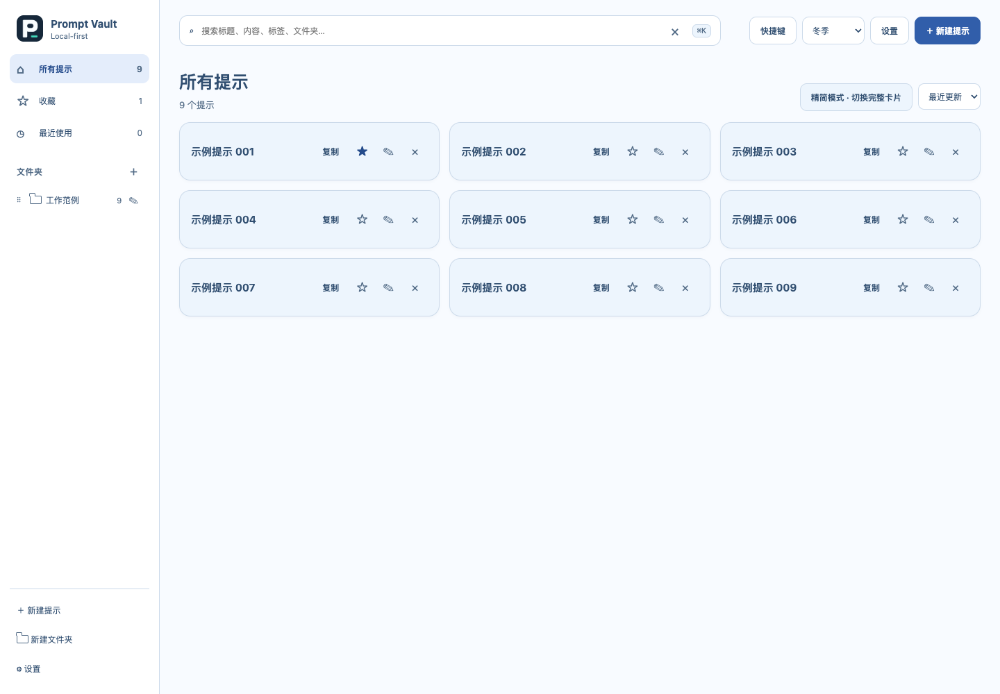

# Prompt Vault

本地优先的 Chrome 提示词管理扩展：整理提示词、切换卡片或精简展示，在侧边栏搜索、填写变量并复制。

**0.4.3** 使用原生 ES modules、HTML/CSS 与 IndexedDB。扩展运行不需构建或第三方运行时依赖；开发验证使用 Node.js 22+。云同步、账号和网页输入框插入尚未实现。

## 使用

运行 `npm run build` 生成独立的 `dist/prompt-vault/` 目录。在 `chrome://extensions/` 开启开发者模式，点击「加载已解压的扩展程序」，选择这个目录即可，不需要 ZIP 或解压。后续修改代码后重新 build，再在 Chrome 中重新加载扩展。

按 [安装指南](docs/installation.md) 在 Chrome 加载已解压扩展。工具栏按钮打开侧边栏，侧边栏入口打开完整管理页；Mac 的 `Option+Shift+P` 默认打开/收起侧栏，快捷键可在 Chrome 扩展快捷键设置中调整。

- 提示词增删改查、单层文件夹、标签、收藏、最近使用。
- 完整卡片与精简标题卡片；正文隐藏后仍参与搜索。
- 跟随系统及冬季、浅色、深色、夜间、赛博朋克、复古、情人节、水蓝、北欧、柠檬水、森林、奢华主题。管理页与侧栏共享设置。
- 变量模板、JSON/CSV 导入预览和导出；[合成示例](examples/sample-prompts.json) 可用于试用。
- 多页面变更通知、保存冲突提示、导入原子提交和失败反馈。
- 整卡点击即使用、侧栏左侧分类、原地收藏、稳定的收藏/累计次数排序、文件夹拖动排序、大号多行变量框、打开管理页自动收起侧栏。[使用与快捷键](docs/interaction-guide.md)。



上图使用合成示例数据。[完整卡片与森林主题](docs/images/cards-forest-v0.4.0.png) 展示另一种组合。

## 数据边界

所有日常操作在本地完成。定期导出 JSON；浏览器登录不会自动同步提示词。JSON 导出仅含存活提示词与分组，不含设置、墓碑和队列；同 ID 导入经预览确认后覆盖，建议先备份。

CSV 不保留 ID、版本和使用历史，重复导入会新增。默认导出保护电子表格公式前缀；原始文本导出不提供该保护，JSON 更适合无损迁移。数据与系统剪贴板没有应用层加密。

删除提示词保留本地墓碑；清空数据删除实体与队列，保留设置及设备/版本元数据。详见 [数据契约](docs/data-model.md) 和 [隐私说明](docs/privacy.md)。队列按实体合并并限制为 10,000 条，尚无云消费者、确认和冲突协议，不是同步服务。

## 开发与验证

```sh
npm ci
npx playwright install chromium
npm run check
npm test
npm run test:e2e
npm run benchmark
npm run build
npm run package
```

`npm run verify` 串行运行静态、单元与扩展测试，`npm run test:package` 验证解压后的实际安装包。打包输出 `dist/prompt-vault-0.4.3.zip`，采用运行资源白名单。0.2.0 基线验证见 [历史记录](docs/reviews/2026-09-18-v0.2.0-validation.md)，0.3.0 交互改造见 [交互验证](docs/reviews/2026-09-18-v0.3.0-interactions.md)，0.4.0 见 [本轮验证](docs/reviews/2026-09-18-v0.4.0-stability.md)。远程 CI 状态见 GitHub Actions。

[文档导航](docs/README.md) · [新增功能方案](docs/decisions/0002-compact-themes-hardening.md) · [实施清单](docs/implementation-checklist.md) · [贡献指南](CONTRIBUTING.md)

快捷键曾因后台 await 丢失用户手势导致无响应，0.4.3 已修复并完成 macOS 级按键验收，见 [调用链修复记录](docs/reviews/2026-09-18-v0.4.3-command-gesture.md)。

## 许可

许可证及正式安全接收渠道仍待维护者决定。图标已替换为项目脚本生成的几何标识；完整来源与开发依赖见 [来源记录](docs/provenance.md)。
