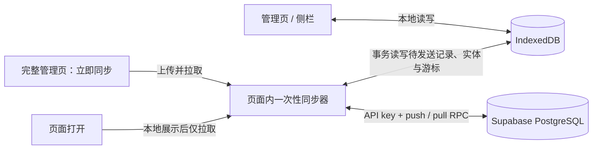

# 本地优先同步与 Supabase 评估

日期：2026-09-19。状态：设计已用于 0.5.0 实现。用户报告 schema v3 在其项目安装并验证通过；客户端实际证据见 [本轮记录](../reviews/2026-09-19-v0.5.0-sync.md)，使用与边界以 [当前指南](../cloud-sync.md) 为准。下文为设计依据，客户端采用基线对比与独立冻结请求，不以旧占位队列为同步日志。

本次修订：确定每位使用者自行部署独立 Supabase 项目，一个库只给一个人使用，支持此人的多台设备；连接仅用 URL + publishable/anon key，不使用 Auth 登录。按用户要求取消所有周期同步、后台监控、自动重试和保存后的自动上传。仅在页面打开时拉取一次，以及在完整管理页点击“立即同步”时执行双向同步；Supabase 连接配置由安装后的用户填写并保存在浏览器本地。

## 结论与适用范围

建议保留 IndexedDB，采用本地立即保存、手动上传、页面打开时异步增量下载。Supabase 托管版是第一候选，采用 PostgreSQL + 事务 RPC；正式选定前验证真实使用网络下的 API key 和数据接口。第一版不接 Realtime，不引入 CRDT 或额外同步平台。

假设：个人多设备使用，接受只有主动触发后才同步的延迟；无多人同时编辑需求；允许云服务读取上传的正文。若要求所有设备秒级一致、多人协作或服务端不可解密，需重审本方案。

第一性原理约束：

- 用户读取的是本机已持久化的数据，打开、搜索、编辑和复制均不能等待网络请求。
- 网络请求可能失败，也可能服务端成功后响应丢失；发起请求的页面随时可能关闭。
- 本地保存成功与云端确认成功是两个状态；本地唯一副本尚未上传时，设备损坏仍可能丢失数据。
- 两台离线设备无法同时保证可编辑和立即一致；接受最终一致，但不能静默丢失正文。
- 同步会传播修改和删除，独立备份仍有必要。

## 当前代码事实

依据 [db.js](../../db.js)、[数据模型](../data-model.md)、[manifest](../../manifest.json)、[后台入口](../../background.js)：

| 已有能力 | 对同步的意义 / 缺口 |
| --- | --- |
| 实体、队列、revision 同事务提交 | 可保留本地写入一致性基础 |
| 按实体合并的 syncQueue | 仅有意图，无冻结载荷、请求身份、服务端基线和 ACK |
| 超过 10,000 条裁剪旧意图 | 正式同步不能继续静默裁剪；旧库可能已缺队列项 |
| 本地 version / revision | 用于本机并发，不能拿来比较不同设备的新旧 |
| 软删除与分组删除时移出提示词 | 需要墓碑传播和服务端跨实体事务 |
| 使用次数与最近使用仅本地更新 | 第一版继续本地保留，避免把计数当普通覆盖字段 |
| clearAllData 硬清实体和队列 | 启用同步前必须定义清本机与清云端的不同语义 |
| MV3 后台，无网络 host 权限 | 增加页面内一次性同步、本地连接配置及按需域名权限；不增加后台调度 |

## 存储选择

提示词、目录、标签、收藏和顺序存 PostgreSQL 的结构化记录。Supabase Storage 主要管理文件，不适合通过反复覆盖整库 JSON 实现双向同步；完整快照可作为独立备份用途。[Storage 文档](https://supabase.com/docs/guides/storage)

Supabase 的价值是托管数据库、API 网关与数据库函数，减少基础服务工作；可靠离线同步协议仍由应用承担。官方列出的 PowerSync 集成包含额外同步层及本地 SQLite；现有项目采用 IndexedDB，第一版没有足够理由为此迁移存储栈。[PowerSync 集成](https://supabase.com/partners/integrations/powersync)

托管地区包含新加坡等，但地区列表不能证明目标网络可达或延迟合格。选址应以实际 API key + RPC 测量为准，不以官网能打开或地理距离代替。[地区文档](https://supabase.com/docs/guides/platform/regions)

核查时 Free 为 500 MB 数据库、存在不活跃暂停机制，Pro 从 25 美元/月起；容量需包含索引、同步日志、墓碑及幂等回执，不能只数正文。免费版适合验证，长期使用还要评估暂停和备份策略。[价格](https://supabase.com/pricing) · [暂停规则](https://supabase.com/docs/guides/platform/free-project-pausing)

若目标网络长期无法在可接受时间内同步，改用经实测可达的托管 PostgreSQL + 小型同步 API；保留同一客户端协议。自托管 Supabase 可行，但备份、升级、监控等责任增加，不作为解决弱网的默认动作。[自托管说明](https://supabase.com/docs/guides/self-hosting)

## 数据路径与同步时机

| 触发 | 行为 |
| --- | --- |
| 管理页或侧栏每次打开 | 先完成本地初始化、展示并绑定交互，再尝试一次增量拉取；未配置/未授权时直接跳过 |
| 完整管理页“立即同步” | 有界地上传待同步修改并拉取远端变化，显示完成、失败或冲突 |
| 保存、新建、删除、移动、排序、导入 | 只提交本地事务并记录待同步修改，不发网络请求 |
| 页面持续打开、恢复焦点、切换分类、搜索 | 不触发云请求；已有本地页面刷新逻辑不变 |
| 页面关闭、浏览器启动、网络恢复 | 不触发同步、不补发、不自动重试 |
| 保存连接配置 | 只保存配置与按需申请该项目域名权限；不隐式同步提示词 |
| 点击测试连接 | 只读验证 URL、key 与协议；不上传提示词 |

打开页面时的“尝试一次”指一轮有界增量读取：必要分页属于这轮请求，不会演变成持续监听。设置整轮时间、页数和字节上限；到上限保留已完整提交的游标，并提示可在完整管理页继续同步。页面关闭或隐藏时取消尚未完成的请求，下一次主动触发再继续；已经在云端提交的写入仍按不确定结果恢复协议处理。

多个页面并发打开时，用扩展同源 Web Lock 合并正在进行的任务；自动拉取拿不到锁就跳过，不排队制造连续请求；手动按钮提示已有同步进行中。锁仅存在于活动操作期间，没有定期检查锁的任务。同步按钮不出现在侧栏。

每次 HTTP 请求初始总超时 10 秒，覆盖响应体读取；整轮设有界预算。失败结束本轮，保留待发送记录与游标，在下次打开页面或点击按钮时按该入口允许的操作继续。打开页面仍只拉取，不重试上传。当前客户端遇到 429 结束本轮并提示稍后手动重试，不设置定时器。

请求使用用户本地配置的 API key。401/403 结束本轮并提示检查 key、权限或安装版本，不登录、不刷新令牌、不自动重试。数据校验错误显示明确原因；只有数据事务成功后才更新成功时间与游标。

不使用 chrome.alarms、setInterval、Realtime/WebSocket、后台联网事件监听、浏览器启动同步或定期刷新令牌。background.js 保留当前快捷键与侧栏职责，不承载云同步；不新增 alarms 权限。单次请求的超时计时器只负责结束请求，不调度下一次任务。

这种设计保证没有周期同步任务，但单次数据传输与应用仍有 CPU/内存开销。用按页处理、字节预算和让出主线程控制开销，不把“事件触发”宣称为零开销。

### 明确的使用结果

设备 A 修改提示词后只保存本地；A 点击“立即同步”后更新才会上传。设备 B 下次打开页面时拉到这次修改。B 一直开着页面则不会自动看到新内容，需要点击“立即同步”或重新打开页面。用户可以从待同步数量和时间看到这一状态。

## 连接配置与界面方案

完整管理页设置新增“云同步”标签页，完整管理页工具栏新增“立即同步”按钮。尚未配置时点击按钮打开对应设置，不显示虚假的同步成功。保存配置后提示“已保存本机，点击立即同步开始”，由用户主动触发数据传输。

| 字段 / 控件 | 规则 |
| --- | --- |
| Project URL | 必填；HTTPS 的 Supabase 项目地址，不接受包含用户名、密码、查询参数或片段的 URL |
| Publishable key / legacy anon key | 必填；密码型输入，默认遮挡，可临时显示；拒绝 secret/service_role key |
| 启用页面打开时拉取 | 明确告知行为，可关闭；首次保存时由用户选择启用 |
| 保存配置 | 仅写 chrome.storage.local；请求当前填写项目的精确域名权限 |
| 测试连接 | 只验证网络、API key 与同步 RPC 是否就绪，不修改云端实体 |
| 立即同步 | 上传本地待同步项并拉取远端修改；仅完整管理页提供 |
| 移除连接配置 | 清除 URL 和 key，停止后续云请求；提示词库不随之删除 |

已核对用户提供的参考项目：它用 Project URL + anon key 初始化客户端，并通过构建环境变量提供配置。这里复用参数含义，改为安装后本地配置；不复制真实 .env、地址或密钥。保留参考项目免登录的接入方式，但只允许调用同步 RPC，不开放直接表读写；不沿用 Realtime 订阅。

配置使用独立 chrome.storage.local 命名空间，排除于 JSON/CSV 导出、提示词同步载荷、日志、仓库和发布包之外。配置只在本机保存，但 API key 仍会作为认证信息发送至用户配置并授权的 Supabase 地址；不发送至其他收集服务。URL/key 不硬编码为实际项目值。

Publishable/anon key 是可公开的应用标识，不证明用户身份。本方案明确授予 anon 角色调用同步接口的能力，因此任何持有本项目有效 key 的人都能读写整库；限定私人独立项目与本地配置，不将这个 key 用在公开网站。没有 Auth、登录或库主绑定。同项目所有有效 publishable/anon key 共享这项能力，不能靠“专用 key”获得独立权限。数据库密码及 secret/service_role key 不是插件配置项。[API keys](https://supabase.com/docs/guides/getting-started/api-keys)

第一版面向托管 Supabase，manifest 声明对应 optional_host_permissions，用户保存时仅申请其项目的精确 origin；未配置和未授权时不发送云请求。自托管域名支持另行增加，不为此默认申请所有 HTTPS 站点权限。扩展源码及发布包始终只包含本地代码，不加载远端 SDK。

本机只配置一个私人云库。变更 Project URL 时暂停同步，不把原项目的待发送记录和游标带入新项目；迁移走明确的导出/导入。不实现本地多账号库管理，旧响应需匹配当前项目配置代次。

## 最小可靠协议

云端具体实现与本节的最终字段约定见 [Supabase 初始化与接口](../supabase-setup.md)，可执行入口为 [setup.sql](../../supabase/setup.sql)。插件端已在 0.5.0 实现。

### 本地状态

保留本机并发 version，另加独立同步元数据：

- 绑定当前项目的 serverVersion、lastPullCursor、lastSuccessfulPullAt、协议版本。
- 每实体待上传 generation、baseServerVersion，以及冻结后不可变的 opId、payload、payloadHash。
- 冲突记录存本地和远端版本、操作身份及用户解决状态。

未发出的修改可按实体合并；已发出或结果不确定的请求不能改载荷、换身份后盲重发。同实体前一请求先完成确认，后续编辑保留为下一代变更。ACK 必须匹配 opId 和发送 generation，只清除被确认的一代，不删除发送期间新发生的编辑。若有后续编辑，接续已确认的 serverVersion，但不能覆盖新正文。

第一版不裁剪未确认记录；可合并尚未发出的同实体状态以控量。达到本地容量限制时明确报错并提供导出，不能显示保存成功后悄悄遗失待上传意图。

### 服务端状态与 API

实际表位于 prompt_vault schema：entities（由 entity_type 区分提示词与目录）、sync_state（唯一一行，记录 schema 版本和全库游标）、sync_changes（不可变变更/事务组）、sync_receipts（幂等结果）。业务表无 user_id/owner_id/tenant_id；各使用者通过独立 Supabase 项目隔离。两个实体共用版本和墓碑外壳，JSONB 正文通过 RPC 严格校验。

实际接口 `pv_sync_push(p_request)` 接收 protocolVersion、opId、deviceId，以及 changes 数组；每项为 entityType、id、baseVersion、deleted、data。一个请求是一整个原子事务组，在数据库事务内完成：

1. Supabase 网关接受 API key 后，以 anon 角色调用；函数先查 opId 回执。同 ID 同载荷返回原结果，同 ID 不同载荷拒绝。
2. 检查服务端版本；新建使用“不存在”的明确基线，不能隐式覆盖同 ID。
3. 校验字段、大小和目录引用；通过后写实体、分配 serverVersion/变更游标、写日志和回执。
4. 整个事务组一起成功或一起冲突；校验错误整体回滚。需要部分成功时，由客户端拆成相互独立的请求。批量请求不能凭 HTTP 200 就清空整批队列。

所有读写均经同步 RPC。表与私有 helper 不向客户端授权，RLS 默认拒绝。公开 RPC 为 SECURITY DEFINER，固定 search_path、完整限定表名，只向 anon 授予执行权限；函数不验证用户身份，仍校验载荷、引用、版本及操作 ID。[函数权限](https://supabase.com/docs/guides/database/functions)

实际接口 `pv_sync_pull(p_cursor, p_limit, p_until)` 返回提交完成的变更组、nextCursor、highWater、hasMore，后续页固定本轮 highWater。采用服务端游标，不能用客户端时间或简单 updatedAt > lastSyncAt。

游标还必须防止提交乱序漏数据：普通自增序列只保证分配递增，不保证事务按该顺序提交。建议在唯一同步状态行上加事务锁，持锁完成实体、计数器、日志、回执写入后提交；所有写入口都遵守该路径。分页只返回已提交的连续可见变更，游标停在最后完整返回的组。不能返回一个事务内尚未全部交付的游标。这是本提案的协议设计，需并发测试验证。[PostgreSQL 事务基础](https://www.postgresql.org/docs/current/transaction-iso.html)

推送回执中的服务端游标不能直接替代 lastPullCursor，否则会跳过其他设备此前的修改。回执只确认相应写入，拉取游标只由成功应用的 pull 响应推进。

每页远端实体更新、冲突保存和拉取游标在同一个 IndexedDB 事务提交；失败全部回滚。拉取不能调用当前 savePrompt/saveFolder 来模拟本地编辑，需要专门的 applyRemoteChanges，避免重新入队、覆盖使用次数或把云端版本混入本地版本。

首次安装可从 cursor=0 分页重放保留的日志，并在本机暂存到一致水位后展示；已有本地库先保留数据，取得云端状态后生成合并预览。第一版暂不回收变更日志、墓碑和幂等回执，以换取协议简单；记录容量增长，不能无限期忽略成本。上线回收前必须补齐固定水位快照、游标过期恢复、陈旧设备拒绝旧写入机制；不得简单按 30/90 天删除后继续接受任意旧操作。

现有 SQL 每请求最多 500 个显式变更，请求及最终事件各不超过 16 MiB。删除目录、整组排序等关联操作作为事务组处理，不盲拆成各自成功的独立写入。当前不提供超大操作的分片暂存，超限会原子拒绝；未来确有需求再添加暂存和最终提交协议。完整事件在本地事务中一并应用，不能向 UI 暴露断裂引用。目标 Supabase 网关限制与容量性能仍需实测。

### 冲突和删除

两台设备均从服务端版本 7 编辑，A 先提交成为 8，B 仍携带基线 7：拒绝覆盖，返回远端 8；B 保存自己的待同步内容和远端版本，提示选择或生成冲突副本。第一版不自动合并正文，也不比较设备时钟。将来若自动合并不同字段，须增加共同基线和明确合并规则。

远端变更遇到本地 dirty 实体时同样不能覆盖或悄悄把 baseServerVersion 更新成最新值。先识别是否为本机已发出操作的回声；其余作为冲突保存。解决冲突是以当前服务端版本为基线的新操作，期间若再次变化则重新冲突。

- 正文冲突允许保留新 ID 副本；副本作为正常新建排队，不因本地保存副本就宣称云端已安全。
- 目录重命名、移动、排序冲突保留待选方案，不自动复制整棵目录。
- 删除与编辑并发不自动复活原 ID；保留编辑内容供另存恢复。墓碑也有服务端版本。
- 删除目录的移出行为由服务端事务统一校验；离线设备引用已删除目录时挂起或经明确选择移至未分组，不能创建悬空引用。
- 同步启用后把“清除本机副本”和“删除云端及所有设备数据”分开。第一版只开放前者，并说明以后会重新下载；有未确认本地改动时先处理导出/保留。云端全清后续另做显式操作及旧设备防复活协议。

## 连接、首次接入与范围

首次启用同步先备份并展示本地与云端合并预览；空云端可上传全部存活数据，同 ID 不一致不静默覆盖。首次接入不把历史墓碑无条件应用到已有云库；不能从“本地没有这个 ID”推断用户要删除云端。syncNeedsFullRescan 只说明旧占位队列不完整，不构成全库强制覆盖授权。

未配置或连接失败时继续使用本地库。异步响应应用前核对项目配置代次，防止更改连接后旧响应落入新的同步状态。移除连接配置停止云请求，没有登录、会话管理或用户切换。

扩展由用户填写 URL + publishable/anon key，拒绝 secret/service_role。所有云端响应作为不可信输入验证，日志不写正文或 key；只按需申请配置域名权限，不增加 alarms。连接配置不写入源代码或发布包。[API key 文档](https://supabase.com/docs/guides/getting-started/api-keys)

第一版同步正文、标题、描述、目录、标签、收藏及顺序；最近使用、使用次数、主题和展示偏好保持本地。远端应用时保留已有设备的本地使用数据，新设备计数从零开始。TLS 和访问权限控制不等于端到端加密；若需要服务端不可读正文，必须在上传真实内容前重新设计密钥恢复与多设备解锁。

UI 提供“已保存本机 / 待同步 N 项 / 同步中 / 上次成功同步时间 / 连接配置错误 / 存在冲突 / 同步错误”。打开界面不出现阻塞式云端加载页。拉取更新不覆盖正在填写的编辑表单；保存时继续使用现有本机版本检查。

## 对抗审查后的修正

| 反例 | 方案修正 |
| --- | --- |
| 云端长期不可达，本机仍可用但另一台始终没有新数据 | 把打开速度与同步可用性分开测量；失败明显可见，提供立即同步和备份 |
| 服务端成功后网络断开 | 固定 opId、冻结载荷、事务回执，允许安全重试 |
| 发送期间继续编辑 | generation 精确 ACK，不能整实体清队列 |
| 拉取覆盖本机未上传文本 | dirty 检查、冲突持久化，不静默覆盖或重设基线 |
| 自增游标 11 先提交，10 后提交 | 全库写事务序列化；验证分页无遗漏 |
| 页面在任意步骤关闭 | 状态落盘、事务应用游标；等下次主动触发恢复，不设 alarm |
| 更改项目配置时旧请求返回 | 项目配置代次校验 |
| 很久未上线的设备上传已删除内容 | 保留墓碑与基线校验；回收前先实现过期设备恢复协议 |
| 存在同步就以为有备份 | 独立快照与恢复演练；同步成功不能防止误删传播 |
| 自研协议成本超过预期 | 范围限于个人多设备与保守冲突；出现协作需求再比较成熟同步引擎 |

## 实施顺序与验收

1. 用合成数据验证候选地区 API key、push/pull 的网络表现；在实际使用网络和不同时段测成功率、P50/P95、超时与最终追平时间，先约定可接受窗口。当前没有目标实例，这些数据尚未获得。
2. 先实现并测试云端版本校验、幂等和变更游标，再迁移本地队列。升级 IndexedDB schema 时保留旧数据、墓碑及本机版本；重建同步状态不能声称恢复已被旧队列裁剪的操作历史。
3. 接通完整管理页手动上传、页面打开一次性拉取、冲突界面和连接配置；更新权限、隐私和数据契约。已有快捷键打开链不加入任何等待网络的步骤。
4. 完成两台独立扩展实例的故障验收；周期同步和实时监听不在本次需求内。

设计验收清单（实际执行范围及未验证项以 [0.5.0 记录](../reviews/2026-09-19-v0.5.0-sync.md) 为准）：

- 未配置零云请求；已配置页面打开时先可用后拉取；持续停留、焦点变化、编辑保存、网络恢复和浏览器启动均无定期或自动上传请求。
- 请求失败只显示本轮失败，经过原方案的 2 分钟/15 分钟窗口也没有重试；页面关闭后无新增请求。
- 配置只存本地，导出、同步载荷、构建产物和日志不含配置；拒绝特权 key，取消域名授权后不继续连接。
- 完整管理页有立即同步按钮，侧栏没有；测试连接和保存配置不上传任何提示词。

- 云端断网/超时 60 秒时，已有本地库照常打开、搜索、编辑和复制；测首屏与纯本地基线的差异，排除后台应用大量数据造成的卡顿。
- 离线编辑、退出浏览器、重新启动、恢复网络本身均不上传；主动点击同步后才追平，不能丢失已经显示本地保存成功的变更。
- 服务端提交但 ACK 丢失，重复请求不重复新增、不重复计数、不反复产生变更日志。
- 上传期间再编辑；旧 ACK 不清掉新修改，旧拉取响应不覆盖新正文。
- 两机修改同一提示词、删除对编辑、目录删除对移动、并发排序，结果可恢复且引用完整。
- pull 分页、应用事务失败、进程停止在实体应用与游标更新附近、事务提交乱序，不跳过数据。
- 首次云库非空、旧库队列已裁剪、JSON 同 ID 导入，均有可解释的合并结果。
- 无效 API key 在网关被拒绝；有效 key 可调用同步 RPC，但直接读写表被拒绝；更改连接后的旧响应不串写。网关部分需真实 HTTP 验证。
- 批量导入超过旧队列上限，以及最大文本输入，能按大小分批并诚实报告拒绝项。
- 使用次数保持本地；同步更新不重置计数，不打断打开的编辑表单。

最小决策验证是“两台设备 + 一条提示词 + 一个目录”：离线修改、并发修改、断 ACK、重启后恢复。它同时检验供应商真实可达性与协议关键正确性，优先级高于做完同步按钮。
